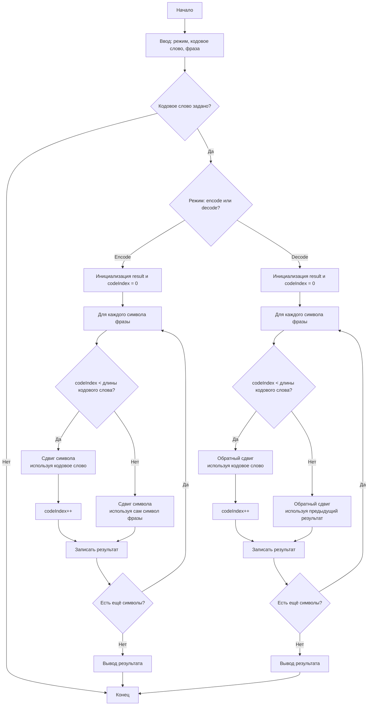

```mermaid
flowchart TD

A[Начало] --> B[Ввод: режим, кодовое слово, фраза]

B --> C{Кодовое слово задано?}
C -- Нет --> Z[Конец]

C -- Да --> D{Режим: encode или decode?}

%% ENCODE
D -- Encode --> E1[Инициализация result и codeIndex = 0]
E1 --> E2[Для каждого символа фразы]

E2 --> E3{codeIndex < длины кодового слова?}

E3 -- Да --> E4[Сдвиг символа\nиспользуя кодовое слово]
E4 --> E5[codeIndex++]

E3 -- Нет --> E6[Сдвиг символа\nиспользуя сам символ фразы]

E5 --> E7[Записать результат]
E6 --> E7

E7 --> E8{Есть ещё символы?}
E8 -- Да --> E2
E8 -- Нет --> E9[Вывод результата]
E9 --> Z

%% DECODE
D -- Decode --> D1[Инициализация result и codeIndex = 0]
D1 --> D2[Для каждого символа фразы]

D2 --> D3{codeIndex < длины кодового слова?}

D3 -- Да --> D4[Обратный сдвиг\nиспользуя кодовое слово]
D4 --> D5[codeIndex++]

D3 -- Нет --> D6[Обратный сдвиг\nиспользуя предыдущий результат]

D5 --> D7[Записать результат]
D6 --> D7

D7 --> D8{Есть ещё символы?}
D8 -- Да --> D2
D8 -- Нет --> D9[Вывод результата]
D9 --> Z
```