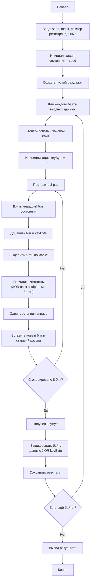

```mermaid
flowchart TD

A[Начало] --> B[Ввод: seed, mask, размер регистра, данные]

B --> C[Инициализация состояния = seed]
C --> D[Создать пустой результат]

D --> E[Для каждого байта входных данных]

E --> F[Сгенерировать ключевой байт]

%% генерация байта
F --> F1[Инициализация keyByte = 0]
F1 --> F2[Повторить 8 раз]

F2 --> F3[Взять младший бит состояния]
F3 --> F4[Добавить бит в keyByte]

F4 --> F5[Выделить биты по маске]
F5 --> F6["Посчитать чётность\n(XOR всех выбранных битов)"]

F6 --> F7[Сдвиг состояния вправо]
F7 --> F8[Вставить новый бит в старший разряд]

F8 --> F9{Сгенерировано 8 бит?}
F9 -- Нет --> F2
F9 -- Да --> G[Получен keyByte]

%% XOR
G --> H[Зашифровать байт:\nданные XOR keyByte]
H --> I[Сохранить результат]

I --> J{Есть ещё байты?}
J -- Да --> E
J -- Нет --> K[Вывод результата]

K --> Z[Конец]
```