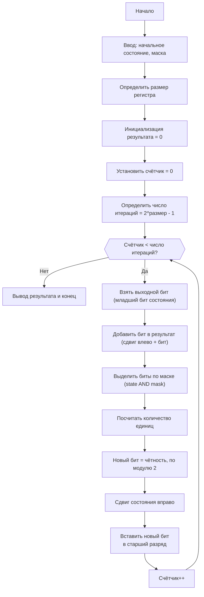

```mermaid
flowchart TD

A[Начало] --> B[Ввод: начальное состояние, маска]

B --> C[Определить размер регистра]
C --> D[Инициализация результата = 0]

D --> E[Установить счётчик = 0]
E --> F[Определить число итераций = 2^размер - 1]

F --> G{{Счётчик < число итераций?}}

G -- Нет --> Z[Вывод результата и конец]

G -- Да --> H["Взять выходной бит (младший бит состояния)"]

H --> I["Добавить бит в результат (сдвиг влево + бит)"]

I --> J["Выделить биты по маске (state AND mask)"]

J --> K[Посчитать количество единиц]

K --> L[Новый бит = чётность, по модулю 2]

L --> M[Сдвиг состояния вправо]

M --> N[Вставить новый бит\nв старший разряд]

N --> O[Счётчик++]
O --> G
```